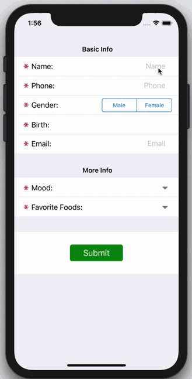
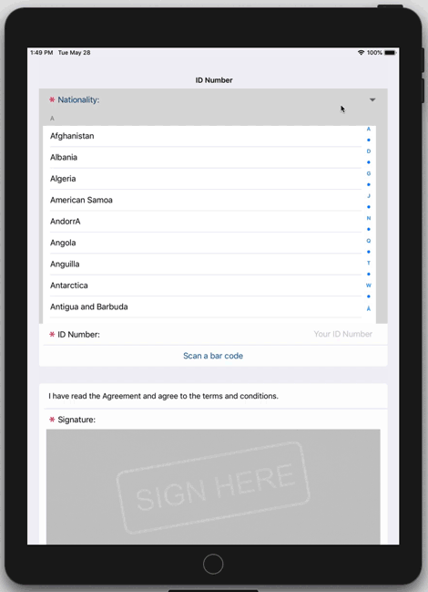

iSwiftForm is a lightweight framework to build iOS Forms. It's written in Swift, simple to use and easy to customize!

* **Requirement:**
  * XCode 10.2.1+, Swift 5.0+
* **Features:**
  * Support iOS 8.0+, iPhone and iPad devices
  * Auto-complete input field
  * Support bluetooth keyboard

<table>
  <tr>
    <th>
      
    </th>
    <th>
      
    </th>
  </tr>
</table>

## Contents

* [Setup](#setup)
  + [Use Podfile](#use-podfile)
  + [Copy source files to your project directly](#copy-source-files-to-your-project-directly)
* [Run the Examples App](#run-the-examples-app)
* [Example usage](#example-usage)
  + [Basic usage](#basic-usage)
  + [Button to open a QR Scanner](#button-to-open-a-qr-scanner)
* [Full APIs](#full-apis)
  + [Global configuration](#global-configuration)
  + [FormBaseDataHolder](#formbasedataholder)
  + [FormDataGroup](#formdatagroup)
  + [FormData](#formdata)
    + [Input (CellType.Input)](#input-celltypeinput)
    + [Text (CellType.Text)](#text-celltypetext)
    + [Select (CellType.ExpandTable)](#select-celltypeexpandtable)
    + [Date Picker (CellType.DateTime)](#date-picker-celltypedatetime)
    + [Button (CellType.Button)](#button-celltypebutton)
    + [Radio Button (CellType.SegmentedControl)](#radio-button-celltypesegmentedcontrol)
    + [Big Button (CellType.ButtonBig)](#big-button-celltypebuttonbig)
    + [Signature (CellType.Signature)](#signature-celltypesignature)
* [Extend the framework](#extend-the-framework)
  + [Add a new form element type](#add-a-new-form-element-type)
* [Contribute](#contribute)

## Setup
### Use Podfile

[To be updated]

### Copy source files to your project directly

1. Download the repo.

2. Copy all the source files under **iSwiftForm/iSwiftForm/Sources/** to your project.

3. Now it's ready to use.

```swift
import iSwiftForm

[Your code]

```

## Run the Examples App

You can run the Examples App on your simulator or your devices:
1. Download the repo.
2. Open the **iSwiftForm.xcworkspace** file.
3. Click the target **iSwiftForm** and **Examples**, config your development team in the **General - Signing** section.
4. Click the scheme **Examples** on the top-left corner, and hit the RUN triangle button.

## Example usage
### Basic usage

1. Create your form class and extends **FormBaseDataHolder**
```swift
class DataHolder: FormBaseDataHolder {
    // Config the form
    override func fillFormData() {
        //
    }
    // Form controls callback
    override func valueChanged(sectionNumber: Int, rowNumber: Int, value: String, formData: FormData) -> Bool {
        //
    }
}

```
2. Override the necessary methods:
```swift
class DataHolder: FormBaseDataHolder {
    var rawData: [String: String] = [:]

    // Config the form
    override func fillFormData() {
        // Create a form group
        var group = FormDataGroup("Basic Info")
        // Add a Input form control
        group += FormData(CellType.Input).config(title: "Name", textSuggestions: ["John Snow", "John Green"]).itemKey("name", self)
        // Add a Segmented form control
        group += FormData(CellType.SegmentedControl).config(title: "Gender", textSuggestions: ["Male", "Female"]).itemKey("gender", self)
        // Add a Date Time form control
        group += FormData(CellType.DateTime).config(title: "Birth").itemKey("birth", self).options(["mode": "date"])
        // Append this form group
        self.append(group)

        // Create another form group
        group = FormDataGroup("More Info")
        // Add a Single Select form control
        group += FormData(CellType.ExpandTable).config(title: "Mood", textSuggestions: ["😝", "😭", "☹️"]).itemKey("mood", self)
        // Add a Multiple Select form control
        group += FormData(CellType.ExpandTable).config(title: "Favorite Foods", textSuggestions: ["🍔", "🍜", "🌽"]).options(["type": "multiple"]).itemKey("food", self)
        // Append this form group
        self.append(group)

        // Create the third form group
        group = FormDataGroup()
        // Add a Big Button form control
        group += FormData(CellType.ButtonBig).config(title: "Submit").options(["color": "none"]).itemKey("submit")
        // Append this form group
        self.append(group)
    }

    // Form controls callback
    override func valueChanged(sectionNumber: Int, rowNumber: Int, value: String, formData: FormData) -> Bool {
        // save the latest form value
        self.rawData[formData.key] = value
        return true;
    }
}
```

3. Present the form UI:
```swift
// Your ViewController
class ViewController: UIViewController {
    override func viewDidAppear(_ animated: Bool) {
        // Create the form data holder, and attach it to the base form viewcontroller
        let vc = DataHolder().attach(FormBaseController());
        // Show it
        self.present(vc, animated: true, completion: nil);
    }
}
```

### Button to open a QR Scanner

```swift
class DataHolder: FormBaseDataHolder, QRScannerCallback {

    // Config the form
    override func fillFormData() {
        ... some form data here ...
        // Add an Input form control
        group += FormData(CellType.Input).config(title: "ID Number", value: self.myFormData["idnumber"])
        // Add a Button form control
        group += FormData(CellType.Button).config(title: "Scan a bar code").itemKey("scan")
    }

    // Form controls callback
    override func valueChanged(sectionNumber: Int, rowNumber: Int, value: String, formData: FormData) -> Bool {
        if (formData.key == "scan") {
            Utils.scanBarcode(key: "idnumber", callback: self, from: self.page)
        }
        return true;
    }

    // QR Scanner Callback
    func qrScannerResult(key: String, value: String) {
        self.myFormData[key] = value
        // Refresh the form
        self.requestUpdate()
    }
}
```

## Full APIs

### Global configuration

#### FormConfigs
* **tableViewSectionColor**: UIColor (default value: 0xF0F0F5)
  + form view controller background color
* **selectedColor**: UIColor (default value: 0x024172)
  + form cell title color (focused)
* **defaultSelectedColor**: UIColor (default value: 0xd9d9d9)
  + form cell background color (focused)
* **buttonTextColor**: UIColor (default value: 0x005aa0)
  + default text color of Button
* **bigButtonTextColor**: UIColor (default value: 0x0C8E11)
  + default text color of Big Button
* **editBackgroundColor**: UIColor (default value: 0xd0d0d0)
  + used in editable Text, the background color of the edit text
* **editBorderNokColor**: UIColor (default value: 0xE25859)
  + used in editable Text, the border color if the edit text isn't validated


* **fillCellWithOKColor**: Bool (default value: false)
  + should the validated cell be filled with a background color
* **okLightGreenColor**: UIColor (default value: 0xd1e9d2)
  + the background color of the validated cell (only show it if fillCellWithOKColor = true)
* **okLightGreenColorFocused**: UIColor (default value: 0xbedfbf)
  + the background color of the focused validated cell (only show it if fillCellWithOKColor = true)

* **headerAlignment**: NSTextAlignment (default value: .center)
  + form group header text alignment
* **headerPadding**: UIEdgeInsets? (default value: UIEdgeInsets(top: 18, left: 18, bottom: 0, right: 0))
  + form group header text paddings

### FormBaseDataHolder
* **page**: FormBaseController
  + the form view controller
* **requestUpdate()**
  + reload the form data
* **append(_ formDataGroup: FormDataGroup)**
  + add a new form group
* **attach(_ page: FormBaseController)** -> FormBaseController
  + attach the data holder to a view controller, return the new view controller


* **fillFormData()**
  + override method. configure the form data
* **valueChanged(sectionNumber: Int, rowNumber: Int, value: String, formData: FormData)** -> Bool
  + override method. form controls callback. return value isn't used for now
* **shouldUpdateWhenAppear()** -> Bool
  + override method. should the form data reloaded when base view controller's viewDidAppear() method called

### FormDataGroup
* **init()**
* **init(_ name: String)**
  - constructor, create a new form data group (with a header text)
* **append(_ formData: FormData)**
* **+=(left: inout FormDataGroup, right: FormData)**
  - append a new form data

### FormData

* **init(_ type: String)**
* **init(_ type: CellType)**
  - construcor, create a new form control
* **config(title: String, value: String? = nil)** -> FormData
  - set the title and the value of the form control

* **config(title: String, textSuggestions: [String], value: String? = nil)** -> FormData
  - set the text suggestions as string array. (for Input auto-complete, Select)
* **config(title: String, textSuggestionSource: TextSuggestionSource, value: String? = nil)** -> FormData
  - set the text suggestions as class. (for Input auto-complete, Select)
* **itemKey(_ key: String, _ rawData: [String: String]? = nil)** -> FormData
  - set a key for the form control. the rawData[key] will be used as the **value** if rawData is not nil

* **options(_ options: [String: String])** -> FormData
  - set some options for the form control
* **enable(_ enable: Bool)** -> FormData
  - is the form control enabled (for Input, Button, etc...)
* **valuePlaceHolder(_ valuePlaceHolder: String)** -> FormData
  - set the placeholder of the input text
* **contentOptions(_ contentOptions: [String: Any])** -> FormData
  - set the content options. this isn't used for now
* **inputType(_ type: InputType)** -> FormData
  - set the keyboard input type

* **validator(_ validator: Validator?)** -> FormData
  - set a custom validator
* **validator(_ type: Validators, _ options: [String: Any]? = nil)** -> FormData
  - set a preset validator, with some options

* **validate()** -> Bool
  - is the form control pass the validation

#### Input (CellType.Input)

* options: **["bold": "true"]
  - the input field will use bold texts

#### Text (CellType.Text)

* options: **["type": "edit"]
  - the form control is editable

#### Select (CellType.ExpandTable)

* options: **["type": "multiple"]
  - is the form control support multiple selection

* options: **["allowDeselect": "true"]
  - is the form control allow deselect items

#### Date Picker (CellType.DateTime)

* options: **["futureDays": "XX"]
  - allow maximum XX days in future to be selected

* options: **["mode": "date | time"]
  - set the data picker mode. the default mode is date and time when the 'mode' option isn't present

* options: **["oneDayAfter": "baseDay, format yyyy-MM-dd HH:mm"]
  - set the available date [baseDay, baseDay + 1 day]

#### Button (CellType.Button)

* options: **["style": "delete"]
  - show the button with red color instead of the primary color

#### Radio Button (CellType.SegmentedControl)

* options: **["disabledSegement": "index, type is Int"]
  - disable certain radio button

#### Big Button (CellType.ButtonBig)

* options: **["color": "red | gray"]
  - show a different button style

#### Signature (CellType.Signature)

* options: **["disableEditIfNotEmpty": "true"]
  - disable the edit once someone signed it

## Extend the framework

### Add a new form control

1. call **CellType.register(_ newType: String)** to register a new type
2. add FormXXCell.swift and FormXX.xib source file to discribe the view and behaviour
3. now you can use the **FormData.init(_ type: String)** to create your own form control

## Contribute

PRs are welcomed. Any ideas please contact me via [Email](malto:wangrqt196@gmail.com)
